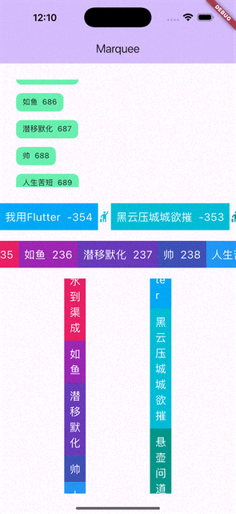

# [flutter_infinite_marquee](https://pub.dev/packages/flutter_infinite_marquee)

一个提供自动滚动功能的跑马灯组件，用于将循环播放的文字或组件滚动到屏幕上。提供了自定义的滚动方向、步长、频率等参数，同时支持点击和滑动交互。
可实现类似冒泡类和跑马灯滚动效果。

## 安装

要使用此包，请在`pubspec.yaml`文件中将`flutter_infinite_marquee`添加为依赖项。

```yaml
dependencies:
  flutter_infinite_marquee: last_version
```

## 用法

在你的Dart文件中导入该包。

```dart
import 'package:flutter_marquee/flutter_marquee.dart';
```
在你的Flutter应用程序中使用`InfiniteMarquee`组件。

```dart
    SizedBox(
      height: 50,
      child:InfiniteMarquee(
          itemBuilder: (BuildContext context, int index) {
            return Text('Hello, world! $index');
          },
      ),
    )
```

## 参数

- `stepOffset`：滚动步进的距离。默认为1。
- `frequency`：自动滚动的频率。默认为10毫秒，配合`stepOffset`参数控制滚动速度。
- `duration`: 动画滚动时长，配合使用，可实现冒泡类效果。
- `itemBuilder`：用于构建跑马灯项目组件的函数。
- `separatorBuilder`：用于构建分隔符组件的函数。
- `initialScrollOffset`：加载时的初始滚动偏移量。
- `scrollDirection`：跑马灯滚动的方向。


## 示例图


请随意定制组件以满足你的应用程序需求。
如果遇到任何问题或有改进建议，请随时在[GitHub issues](https://github.com/chenyeju295/flutter_infinite_marquee/issues)上创建问题。感谢使用！
