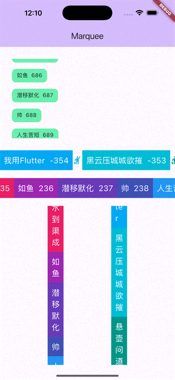

# flutter_infinite_marquee

A marquee component that provides the function of automatic scrolling, used to scroll the text or components that play in a loop onto the screen. It provides custom scrolling directions, step lengths, frequencies and other parameters, and also supports click and swipe interactions.

## Installation
To use this package, add flutter_infinite_marquee as a dependency in the pubspec.yaml file.
```yaml
dependencies:
  flutter_infinite_marquee: ^0.0.1
```

## Usage
Import the package in your Dart file.

```dart
import 'package:flutter_marquee/flutter_marquee.dart';
```

```dart
SizedBox(
      height: 50,
      child:InfiniteMarquee(
          itemBuilder: (BuildContext context, int index) {
            return Text('Hello, world! $index');
          },
      ),
    )
```

## Parameters
- stepOffset: The distance of the scrolling step. The default is 1.
- frequency: The frequency of automatic scrolling. The default is 10 milliseconds, which controls the scrolling 
  speed in conjunction with the stepOffset parameter.
- duration: The duration of the animation when scrolling.
- itemBuilder: A function used to build the components of the marquee items.
- separatorBuilder: A function used to build the components of the separator.
- initialScrollOffset: The initial scrolling offset when loading.
- scrollDirection: The direction in which the marquee scrolls.

## Sample diagram



Feel free to customize the marquee component to meet the needs of your application.
If you encounter any problems or have suggestions for improvement, please create an issue on [GitHub issues](https://github.com/chenyeju295/flutter_infinite_marquee/issues) at any time. Thank you for using!
